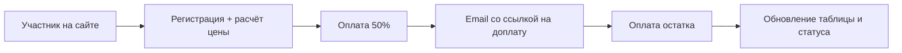

# Universal Application Engine · Hanuman Fest 2026

> **Статус документа:** исторический обзор ценности + техприложение.  
> Актуальная архитектура и домены: [`ARCHITECTURE.md`](ARCHITECTURE.md), [`PROJECT.md`](PROJECT.md), [`DOMAINS.md`](DOMAINS.md).  
> API живёт на **`https://хануманфест.рф/api`** (поддомен `апи.` не используем).

Документ в двух частях: **верх** — для заказчика (ценность, опыт пользователя, процессы). **Низ** — техническое приложение для команды разработки.

---

# Часть 1. Для заказчика

## Зачем мы это делали

К фестивалю 2026 накопилась рабочая, но хрупкая связка: сайт на WordPress, формы Forminator, оплата через YooKassa, учёт в Google-таблице. Она тянула регистрацию, но каждое изменение цен или правил несло риск что-то сломать вручную.

**Цель проекта** — не переломать текущий поток доплат в этом сезоне, а построить систему, которой можно пользоваться предсказуемо: участнику проще регистрироваться и платить, команде — меньше ручной работы и меньше ошибок.

---

## Что изменилось для участника

### Быстрее и понятнее регистрация

| Было (Forminator)                                             | Стало |
|---------------------------------------------------------------|--------|
| Тяжёлая форма внутри WordPress, долгий отклик при регистрации | Лёгкая форма на сайте, расчёт суммы — сразу после изменения данных |
| Логика цен «зашита» в настройки формы                         | Цена берётся из актуального тарифа автоматически |
| Неочевидные шаги при групповой регистрации                    | Прозрачный пересчёт: состав группы → сумма → оплата |

**Смысл для человека:** меньше ожидания, меньше сюрпризов в сумме, меньше «залипаний» формы на телефоне.

### Оплата в два шага — без звонков и ручных счетов

1. При регистрации участник платит **50%** (или другую согласованную часть).
2. После оплаты на email приходит **персональная ссылка** на доплату остатка.
3. По ссылке — отдельная короткая страница: без повторного заполнения анкеты, только оплата.

Ссылка действует **90 дней**. Участник может вернуться к доплате в удобное время.

### После оплаты — ясный статус

Страница возврата с сайта показывает, прошла ли оплата. Не нужно гадать и писать в поддержку «деньги списались или нет».

---

## Что изменилось для команды организаторов

### Google-таблица остаётся, но перестаёт быть «источником правды»

Таблица **«Регистрации»** по-прежнему нужна команде: просмотр, фильтры, ручные пометки.

| Что можно | Что нельзя / не нужно |
|-----------|------------------------|
| Добавлять колонки, менять порядок | Вручную переключать тарифы в Forminator в день смены периода |
| Вести заметки и комментарии в таблице | Бояться, что правка ячейки сломает автоматический экспорт |
| Смотреть оплату 1 и 2, остаток, итог | Дублировать заявки вручную после каждой оплаты |

**Экспорт односторонний:** система сама добавляет строку при регистрации и обновляет платёжные поля после оплаты. Ручные правки вне этих полей экспорт не затирает.

### Периоды цен — без «забыли переключить в нужный день»

Раньше при наступлении нового тарифного окна (до 10 марта → до 1 июня → после 1 июня) кто-то должен был **вручную** менять настройки Forminator.

Теперь периоды заданы заранее с датами начала и конца. В нужный день **цена переключается сама** — по дате регистрации.

### Удобное управление ценами в админке

Вместо копания в Forminator:

- список периодов с датами;
- одна форма — все варианты участия (палатка, дом, один день, с питанием / без) и их цены;
- изменения сразу отражаются на сайте.

---

## Ключевые возможности (product view)



| Возможность | Польза |
|-------------|--------|
| **Ссылка на доплату** | Участник доплачивает сам, без повторной анкеты |
| **Автопериоды цен** | Нет ручного переключения тарифов по календарю |
| **Экспорт в Google Sheets** | Команда видит актуальные данные, может править таблицу |
| **Админка периодов и цен** | Быстрые изменения без разработчика |
| **Быстрая форма** | Меньше отказов на этапе регистрации |

---

## Было → стало (кратко)

| Область | Было | Стало |
|---------|------|-------|
| Регистрация | Forminator на WordPress | Форма на сайте + централизованный расчёт |
| Цены | Ручная смена в форме по датам | Автовыбор периода по дате |
| Доплата | Костыли, ручные напоминания | Персональная ссылка + письмо |
| Учёт | Таблица + разрозненные источники | База данных + зеркало в таблице |
| Управление | Настройки плагинов | Админка: заявки, платежи, периоды, цены |

---

## Стратегия на 2026 год

Текущий боевой поток (Forminator, старые доплаты) **не ломаем**. Новая система тестируется на отдельных страницах сайта; после проверки — переключение основного потока на следующий сезон.

Это снижает риск для текущих участников и даёт время обкатать регистрацию и доплаты на живом трафике.

---

## Итог для бизнеса

- **Участник:** быстрее регистрация, понятная оплата, доплата по ссылке.
- **Команда:** таблица остаётся рабочим инструментом, меньше ручных операций и ошибок с ценами.
- **Организация:** фундамент на следующие фестивали — не «ещё один костыль в WordPress», а отдельная система учёта.

---

<br>

---

# Часть 2. Для разработчика (техническое приложение)

> Эту часть можно не включать в материалы для заказчика.

## Архитектура

```
хануманфест.рф (Symfony: Twig-сайт + /api + /admin + MySQL)
        │
        ├── YooKassa
        ├── Google Sheets API
        └── SMTP
```

Переходный / параллельный контур (до cutover): WordPress + bridge на том же домене может ещё принимать боевые заявки; см. `PARALLEL_TESTING.md`.

- **Источник правды после cutover:** MySQL (`Application`, `Payment`, `PaymentLink`, `PricingPeriod`, …).
- **Sheets:** зеркало для команды; Symfony пишет строки через Google Sheets API.
- **Публичная форма:** Symfony Twig + `public/assets/site/registration.js` (legacy bridge в `legacy/wordpress/` — архив / параллельный тест).

---

## Поток регистрации (API)

1. `GET /api/product` — варианты участия и активный период.
2. `POST /api/calculate` — `FestivalPricingCalculator` (`participationOptionId`), формула parity с Forminator calculation-1.
3. `POST /api/applications` — заявка + `GoogleSheetsExportService::exportApplication` (`action: application`).
4. `POST /api/payments` — YooKassa, сумма = min(payNowAmount, remaining).
5. Webhook `POST /api/webhooks/yookassa` — обновление статуса, экспорт payment, при 50% — PaymentLink + email.

---

## Механизм ссылки на доплату

| Компонент | Назначение |
|-----------|------------|
| `PaymentLink` entity | UUID-токен, TTL 90 дней, привязка к `Application` |
| `PaymentLinkService` | `createForApplication`, `getValidLink` |
| `PaymentService::markPaymentSucceeded` | При `PartiallyPaid` и пустом списке links → создаёт link |
| `PaymentNotificationService` | Email со ссылкой на `[uae_payment]?token=…` |
| `GET /api/payment-links/{token}` | Данные для страницы доплаты |
| `POST /api/payment-links/{token}/pay` | Создание платежа YooKassa на `remaining` |
| `app:payment-links:generate` | CLI для legacy-заявок без link |

---

## Google Sheets

**Клиент:** `GoogleSheetsClient` → Google Sheets API (service account, `GOOGLE_SHEETS_CREDENTIALS`) в таблицу `REGISTRATION_SHEET_URL`.

Строка листа «Регистрации»: name, phone, email, adultsCount, childrenCount, totalAmount, paidTotal, participationOptionName, transferIncluded, paymentFactor, notes, payment1*, payment2*, remaining, payNowAmount, pricingPeriodName, applicationUuid.

- `paidTotal` — сумма успешных платежей.
- `remaining` — остаток к оплате.

Поиск строки: `applicationUuid`. Заявка не перезаписывает уже существующую строку; оплата дописывает payment1/payment2.

**Ресинк:** `app:payments:sync-google-sheets`.

---

## Периоды цен

- `PricingPeriod`: `startAt`, `endAt`, `isActive`.
- `FestivalPricingCalculator::resolvePricingPeriod` — первый активный период, в который попадает дата (после окна — последний период).
- `ParticipationPrice` — матрица цен период × вариант участия.
- Админка: один экран `/admin/pricing` (`PricingMatrixController`).
- Seed: `app:seed:hanuman-fest`.

---

## Админка

- EasyAdmin: заявки, платежи, пользователи; контент (hero, люди по разделам, галерея, FAQ, отзывы, инфоблоки); матрица цен.
- Form login + session (`/admin/login`).
- Операции импорта / sync — через CLI (`app:import:legacy-orders`, `app:import:schedule`, `app:payments:sync-google-sheets`).

---

## Деплой и диагностика

- Хостинг: Timeweb, PHP 8.5, MySQL 8.0, document root `public/`.
- `bash bin/deploy-prod.sh` — composer `--no-dev`, migrations, cache reset, `assets:install`, удаление `.env.local.php`.
- Monolog → `var/log/prod.log`.
- Smoke: `GET /api/health`, `GET /api/product`.
- Подробности: `DEPLOY_TIMEWEB.md`, `PARALLEL_TESTING.md`.

---

## Тесты и репозиторий

- PHPUnit 11.x: pricing, payments, API, admin, CMS.
- `composer test`.

---

## Связанные файлы

| Область | Путь |
|---------|------|
| Публичная регистрация | `templates/site/_registration_widget.html.twig`, `public/assets/site/registration.js` |
| Bridge (legacy) | `legacy/wordpress/universal-application-engine-bridge.php` |
| Apps Script | `legacy/google-apps-script/Code.by-columns.gs` |
| Pricing | `src/Service/FestivalPricingCalculator.php`, `src/Controller/Admin/PricingMatrixController.php` |
| Payments | `src/Service/PaymentService.php` |
| Sheets | `src/Infrastructure/GoogleSheets/` |

---

*Актуализация авг 2026 · Hanuman Fest · https://хануманфест.рф*
